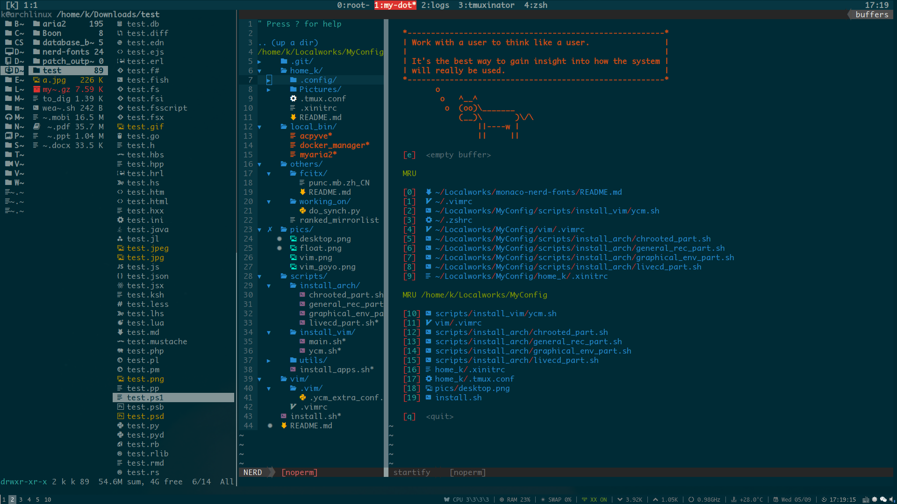

monaco-nerd-fonts
=================

Terminal-friendly monaco font, with extra nerd glyphs, patched with [ryanoasis's nerd patcher](https://github.com/ryanoasis/nerd-fonts).

### update

2019-3-18: Updating freetype2 to version `2.10.*` might break the font on Archlinux. To fix it, check https://github.com/Karmenzind/monaco-nerd-fonts/issues/2 (thanks to @guihkx). I'll update the font file at my leisure time.

### files

- Monaco Nerd Font Complete.otf
- Monaco Nerd Font Complete Windows Compatible.otf
- Monaco Nerd Font Complete Mono.otf
- Monaco Nerd Font Complete Mono Windows Compatible.otf

### usage

Download the font file, mv it to `/usr/share/fonts/<custom-dir>`.
If necessary, run
```
sudo fc-cache -fv
```
or follow [ArchWiki](https://wiki.archlinux.org/index.php/Fonts#Manual_installation) 
to make new fonts available.

### screenshot



### problems

Обновление Monaco - получаем на OSX шрифт увеличенного размера, шрифт из репозитария - получаем чуть меньше межстроцное расстояние.

```bash
./font-patcher -c -l Monaco.ttf 
```

Размеры шрифтов units-per-em (UPM)

* [Глубокое погружение в CSS: показатели шрифтов, line-height и vertical-align](https://tpverstak.ru/css-font-metrics-line-height-and-vertical-align/)
* [Vertical metrics](https://glyphsapp.com/learn/vertical-metrics)